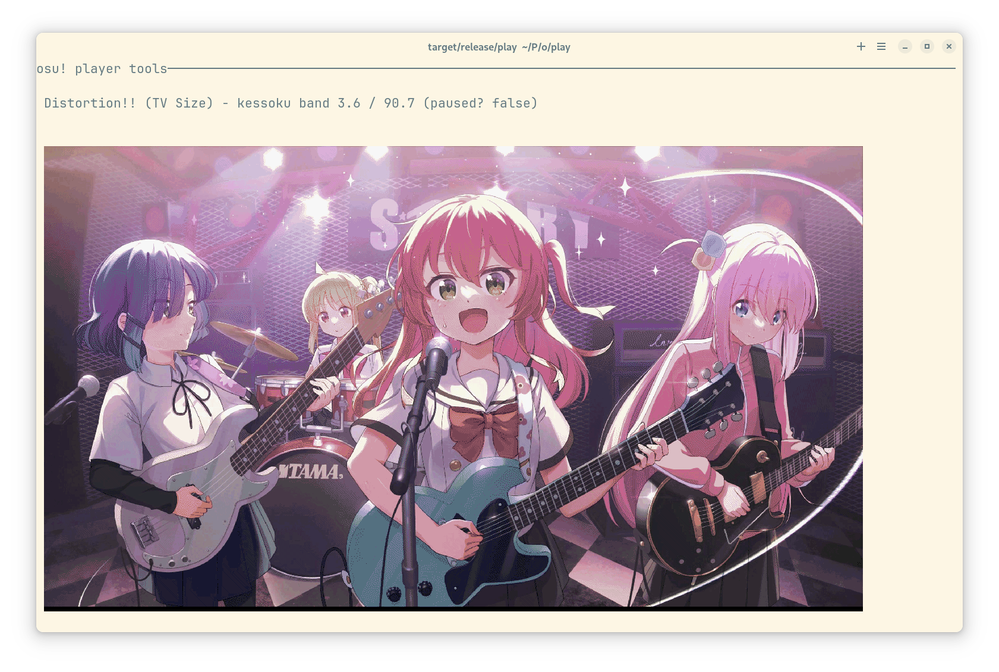
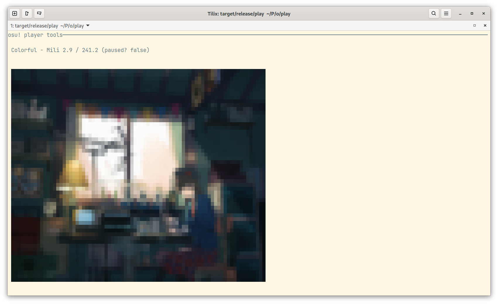
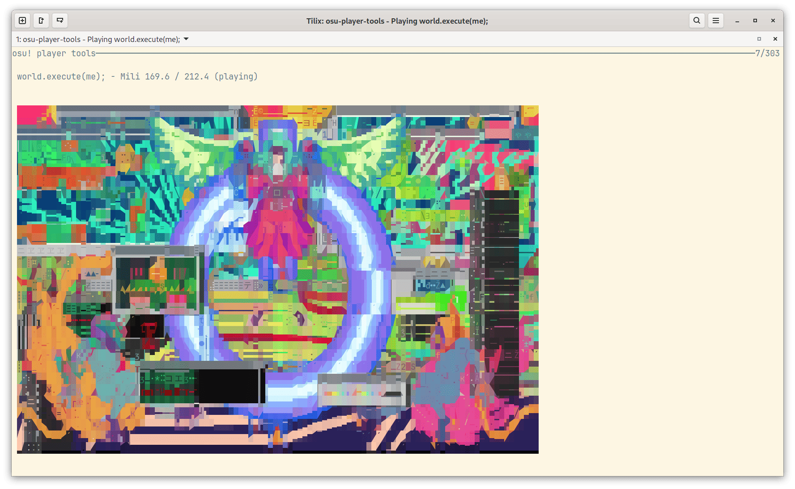
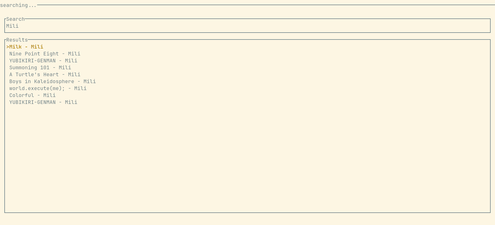

# clicking-circles-player

An interactive terminal player for playing osu! songs.

`RealmHashExtractor` uses code from <https://github.com/ookiineko/CollectionDowngrader> (and thus <https://github.com/ppy/osu/>).

A web version created by LLM is at [play-web](./play-web/). This is just an experiment and it might be refactored later.

## TODOs

- [x] Add a proper README.
- [x] Code cleanup (currently it is done rushy and messy).
- [x] Show correct metadata in mpris.
- [x] TUI support.
- [x] Search.

## How to use

Assuming that you're using <https://github.com/flathub/sh.ppy.osu>, which data folder is `~/.var/app/sh.ppy.osu/data/osu/`.

### RealmHashExtractor

```sh
cd RealmHashExtractor
dotnet run -- ~/.var/app/sh.ppy.osu/data/osu/client.realm --collection Songs -o ../song.json
```

### Player

```sh
cargo build --release
target/release/play ../song.json ~/.var/app/sh.ppy.osu/data/osu/files/
```

#### Flatpak build

```sh
flatpak-builder --install repo build-aux/moe.taoky.clicking-circles-player.yaml --user --force-clean
flatpak run --file-forwarding moe.taoky.clicking-circles-player @@ ../song.json @@ ~/.var/app/sh.ppy.osu/data/osu/files/
```

Please note that flatpak currently does not support forwarding folder (see <https://github.com/flatpak/flatpak/issues/4799>). You need to add folder to permissions manually (e.g., use Flatseal) if it's not at osu!'s default location.

#### Keyboard shortcuts

- q: quit
- <: previous song
- \>: next song
- space: pause/play
- u: toggle unicode mode
- (left): seek backward 5s
- (right): seek forward 5s
- s: search mode
    - ESC: exit search mode
- r: toggle repeat mode

#### Screenshots



(BlackBox)

Based on [ratatui-image](https://github.com/benjajaja/ratatui-image/), it could show image even if your console does not support sixel -- with Unicode half-block characters.



(Tilix)

And currently it would build with [chafa-sys](https://crates.io/crates/chafa-sys) (with a forked [ratatui-image](https://github.com/taoky/ratatui-image/)) by default, to provide a better image rendering when other advanced image protocols are not available:



This could be disabled with:

```shell
cargo build --release --no-default-features
```

to still fallback to half-block characters.



Search mode.

### archive/play.py

A very simple script to play songs, does not support TUI, mpris, ...

## License

MIT.

This project is not affiliated with or endorsed by the official "osu!" or "ppy" brands.
